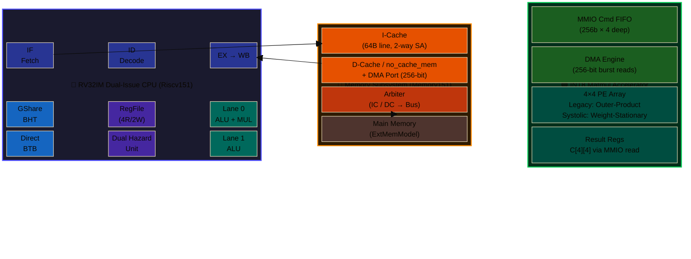

# Bare-Metal MNIST Inference on Custom RV32IM CPU and Matmul Accelerator

This repository is the integration and simulation workspace for bare-metal MNIST inference on a custom RISC-V core and hardware accelerator.

## Project Motivation

This project is motivated by a practical systems question
how much end to end inference speedup can be achieved by co-designing software, CPU microarchitecture, and a domain specific accelerator under realistic hardware constraints.

The baseline software-only path on a small in-order RV32 core is functional but too slow for efficient embedded inference.
Most execution time is concentrated in dense matrix operations and surrounding control overhead.
That makes this workload a good target for

- instruction level parallelism improvements in the CPU including dual issue
- data movement and tiling improvements in the runtime
- specialized matmul hardware to reduce cycles spent in multiply accumulate loops

The goal is not only to maximize a single benchmark number.
The goal is to build a reproducible workflow where each optimization can be measured, validated, and traced from RTL behavior to end to end application impact.

## System Microarchitecture



### Data Path and Interconnect

```
┌──────────────────────────────────────────────────────────────────────────────────────────────────┐
│                                         riscv_top (SoC)                                          │
│                                                                                                  │
│  ┌────────────────────────────────┐        ┌───────────────┐       ┌──────────────────────────┐  │
│  │    RV32IM CPU (Riscv151)       │        │  Memory151    │       │    MatmulAccelerator     │  │
│  │                                │ icache │               │       │                          │  │
│  │  ┌────┐  ┌────┐  ┌────┐ ┌────┐ │───addr ─▶ ┌─────────┐  │       │  ┌────────────────────┐  │  │
│  │  │ IF │─▶│ ID │─▶│ EX │▶│ WB │ │◀─64b───── │ I-Cache │  │       │  │   MMIO Cmd FIFO    │  │  │
│  │  └──┬─┘  └──┬─┘  └──┬─┘ └──┬─┘ │  inst  │  └─────────┘  │       │  │  (256b × 4-deep)   │  │  │
│  │  ┌──┴───┐ ┌─┴───┐ ┌──┴───┐  │  │        │               │       │  └────────┬───────────┘  │  │
│  │  │GShare│ │ Reg │ │Lane 0│  │  │  dcache│  ┌─────────┐  │       │           │              │  │
│  │  │ BHT  │ │File │ │ALU+  │  │  │───addr─▶  │ D-Cache │  │       │  ┌────────▼───────────┐  │  │
│  │  │      │ │4R/2W│ │ MUL  │  │  │◀─32b───── │/ no_mem │  │       │  │    DMA Engine      │  │  │
│  │  │ BTB  │ │     │ ├──────┤  │  │  data  │  │ + DMA   │──╋──256b─╋─▶│  (256-bit burst)   │  │  │
│  │  └──────┘ │Dual │ │Lane 1│  │  │        │  └────┬────┘  │       │  └────────┬───────────┘  │  │
│  │           │ Hzd │ │ ALU  │  │  │        │       │       │       │           │              │  │  
│  │           └─────┘ └──────┘  │  │        │  ┌─────────┐  |          ┌────────▼───────────┐  │  │
│  │                             │  │        │  │ Arbiter │  │       │  │  4×4 PE Array      │  │  │
│  └─────────────────────────────┘  │        │  └────┬────┘  │       │  │                    │  │  │
│           │                       │        │       │       │       │  │  Legacy: Outer-    │  │  │
│           └───────────────────────╋───────╋──▶ Main Mem │  │       │  │  Systolic: Weight- │  │  │
│                                   │        │  │(ExtMem) │  │       │  │   Stationary Array │  │  │
│                mmio_we/re ────────╋────────╋──╋─────────╋──╋───────╋─▶│                    │  │  │
│                mmio_rdata ◀───────╋────────╋──╋─────────╋──╋───────╋──│  C[4][4] results   │  │  │
│                                   │        │  └─────────┘  │       │  │  readable via MMIO │  │  │
│                                   │        └───────────────┘       │  └────────────────────┘  │  │
└──────────────────────────────────────────────────────────────────────────────────────────────────┘

 Key signals:
   CPU ──icache_addr──▶ Memory151 ──64b inst──▶ CPU          (instruction fetch, 64-bit for dual-issue)
   CPU ──dcache_addr──▶ Memory151 ──32b data──▶ CPU          (load/store path, addr[31]=0)
   CPU ──mmio_we/re───▶ Accelerator ──rdata──▶ CPU           (MMIO control, addr[31]=1)
   Accelerator ──dma_addr──▶ Memory151 ──256b──▶ Accelerator  (DMA bulk data path, bypasses CPU)
```

## Scope

- CPU and SoC RTL source is referenced from `../asic-project-fa25-golden-gates/src` by default in this repo `Makefile`
- This repo provides
  - software workload `inference_bare.c`
  - accelerator RTL wrapper and implementations in `riscv-accelerator/`
  - Verilator harness `sim_main.cpp`
  - OpenLane workspace in `OpenLane/`

## Current Accelerator Modes

`riscv-accelerator/MatmulAccelerator.sv` selects one implementation at compile time

- Legacy path default
  - `riscv-accelerator/legacy/MatmulAcceleratorLegacy.sv`
  - DMA-fed 4x4 outer-product style engine
  - prints `ACCEL_PERF ...`

- Systolic path optional
  - enable with `EXTRA_VFLAGS="-DUSE_SYSTOLIC_ACCEL"`
  - `riscv-accelerator/systolic/MatmulAcceleratorSystolic.sv`
  - prints `ACCEL_PERF_SYSTOLIC ...`
  - currently modeled as a simplified systolic command timing path and not yet DMA-fed for operand movement in this branch

## Verified Results

Verified on February 25 2026 with

```bash
cd riscv-nn-inference
```

### Legacy accelerator

```bash
make clean && make run ENABLE_DUAL_ISSUE=0
make clean && make run ENABLE_DUAL_ISSUE=1
```

| Mode | Total cycles | Retired IPC | Status |
|---|---:|---:|---|
| SI | 1496975 | 0.895807 | PASSED |
| DI | 1343765 | 0.997669 | PASSED |

Representative legacy perf line

```text
ACCEL_PERF cmd=1 k_limit=196 busy=398 compute=196 stall=192 fill=394 dma_req=392 produced=196 consumed=196 occ0=196 occ1=196 occ2=3 occ_max=2 ...
```

### Systolic accelerator

```bash
make clean && make run ENABLE_DUAL_ISSUE=0 EXTRA_VFLAGS="-DUSE_SYSTOLIC_ACCEL"
make clean && make run ENABLE_DUAL_ISSUE=1 EXTRA_VFLAGS="-DUSE_SYSTOLIC_ACCEL"
```

| Mode | Total cycles | Retired IPC | Status |
|---|---:|---:|---|
| SI | 1338227 | 0.913079 | PASSED |
| DI | 1184508 | 1.031573 | PASSED |

Representative systolic perf line

```text
ACCEL_PERF_SYSTOLIC cmd=1 k_limit=196 busy=205 compute=196 stall=9 dma_req=0
```

## Build and Run

Default run uses legacy accelerator and dual issue enabled by default in `Makefile`

```bash
make clean
make run
```

Useful knobs

- `ENABLE_DUAL_ISSUE=0|1` controls CPU dual issue define
- `EXTRA_VFLAGS="-DUSE_SYSTOLIC_ACCEL"` selects systolic accelerator path
- `CFLAGS_EXTRA="..."` passes workload compile-time flags
- `EXTRA_FLAGS="..."` passes simulator plusargs

## Key Files

- `Makefile` build and run entry point
- `inference_bare.c` bare-metal MNIST runtime and accelerator driver
- `sim_main.cpp` hex loader and simulation harness
- `riscv-accelerator/MatmulAccelerator.sv` implementation selector
- `riscv-accelerator/legacy/MatmulAcceleratorLegacy.sv` legacy accelerator
- `riscv-accelerator/systolic/MatmulAcceleratorSystolic.sv` systolic accelerator
- `improvements/` dated engineering logs

## Notes on Accuracy and Reproducibility

- Cycle count and IPC depend on selected accelerator mode and compile flags
- Always report the exact command line with `ENABLE_DUAL_ISSUE` and `EXTRA_VFLAGS`
- The simulator load base and tohost behavior are defined in `sim_main.cpp` and the runtime code

## OpenLane

The OpenLane workspace in this repo is used for physical design experiments

```bash
cd OpenLane
make mount
./flow.tcl -design riscv_top
```

Use generated run logs and reports under `OpenLane/designs/riscv_top/runs/` for timing and routing status
